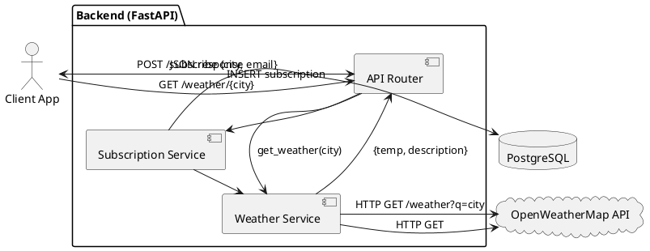

# Отчет по Практике 1: REFERENCE SOLUTION

**Группа:** TEACHER
**Участники:** AI Assistant
**Дата:** 2025-11-20

## 1. Бизнес-артефакты и планирование

### Event storming (light)

## Actors
- API Client (Web/Mobile App)
- Система нотификаций (Scheduler/Worker)
- Администратор сервиса

## Commands
- CreateSubscription (POST /subscribe)
- DeleteSubscription (DELETE /subscribe/{id})
- GetCurrentWeather (GET /weather/{city})
- ListSubscriptions (GET /subscriptions)
- SendNotification (internal)

## Domain Events
- SubscriptionCreated
- SubscriptionDeleted
- WeatherRequested
- WeatherFetched
- NotificationScheduled
- NotificationSent

### CJM

1. Пользователь открывает клиент (Web/Mobile) и выбирает город.
2. Клиент отправляет запрос на подписку в API (POST /subscribe).
3. Backend валидирует данные и сохраняет подписку в PostgreSQL.
4. По расписанию worker инициирует получение погоды для активных подписок.
5. Backend запрашивает погоду во внешнем Weather API.
6. Backend формирует сообщение и отправляет нотификацию (канал зависит от клиента).
7. Пользователь получает уведомление и при необходимости изменяет/удаляет подписку.

### Roadmap

## v1.0 (минимальный слайс, 1–2 дня)
- CRUD подписок: создать/удалить/посмотреть список (PostgreSQL)
- Получение текущей погоды по городу (через внешнее API)
- Базовые контракты ошибок (валидация, city not found, external timeout)

## v1.1
- Периодические уведомления (scheduler/worker) + конфиг частоты
- Идемпотентность создания подписки (не создавать дубликаты)
- Базовые метрики/статистика (admin)

## v2.0
- Мультиязычность/локализация
- Каналы уведомлений (Telegram/Email/Push) как плагины
- Кэширование/лимиты внешнего API

### Epics

1. Subscription Management
2. Weather Retrieval
3. Notification Delivery
4. Observability & Admin
5. Reliability & Error Handling

### User Stories

1. Как пользователь клиента (Web/Mobile), я хочу подписаться на город через POST /subscribe, чтобы получать уведомления о погоде.
2. Как пользователь, я хочу отписаться от города, чтобы перестать получать уведомления.
3. Как пользователь, я хочу получить текущую погоду через GET /weather/{city}, чтобы принять решение (зонтик/одежда).
4. Как пользователь, я хочу видеть список моих подписок, чтобы управлять ими.
5. Как администратор, я хочу видеть базовую статистику подписок, чтобы оценивать нагрузку.

### Definition of Ready (DoR)

- [ ] User Story имеет четкую ценность (Value).
- [ ] Описаны входные/выходные данные и коды ошибок (контракт).
- [ ] Зависимости (API, библиотеки) определены и доступны.
- [ ] Согласован минимальный слайс (v1.0/v1.1/v2.0).
- [ ] Оценен объем работ (story points / hours).
- [ ] Нет блокирующих вопросов к Product Owner.

## 2. Архитектура

### Компоненты

1. **FastAPI Backend:** REST API эндпоинты (/subscribe, /weather, /subscriptions).
2. **Subscription Service:** Логика управления подписками (CRUD) с PostgreSQL.
3. **Weather Service:** Асинхронный клиент к OpenWeatherMap API.
4. **PostgreSQL Database:** Хранение users и subscriptions (таблицы: users, subscriptions).
5. **Client Applications:** Веб/мобильные приложения, взаимодействующие с API.

### ADR

## Контекст
Нужен минимальный REST API сервис для подписок на погоду, который можно быстро реализовать и проверить.
Внешний Weather API может быть недоступен, поэтому важны явные контракты ошибок и таймауты.

## Решение
Выбираем монолитный Backend на FastAPI с выделением сервисов (Subscription/Weather) внутри приложения.
Храним подписки в PostgreSQL. Для v1.0 делаем только API-контракты и ручные вызовы получения погоды.
Периодические уведомления выносим в v1.1 (scheduler/worker).

## Альтернативы
- Микросервисы + очередь: избыточно для v1.0.
- SQLite вместо PostgreSQL: проще для локальной разработки, но ограничения масштабируемости.

## Последствия / Trade-offs
- Плюсы: готово к продакшену, хорошая масштабируемость, поддержка транзакций.
- Минусы: требует настройки и управления базой данных; для простых случаев может быть избыточно.

### PlantUML

### Ссылка на схему

./artifacts/board/architecture.png

## 3. Качество

### Definition of Done

- [ ] Код написан и соответствует PEP8.
- [ ] Пройдены unit/integration тесты для критичных сценариев (позитивные + негативные).
- [ ] Контракты ошибок задокументированы (HTTP codes + тело ответа).
- [ ] Документация (README) обновлена.
- [ ] Код залит в репозиторий (Pull Request merged).

### План тестирования

1. **Positive: Подписка на существующий город через API.**
   - Request: POST /subscribe {"city": "London", "email": "user@test.com"}
   - Response: 200 OK, {"message": "Subscribed to London"}
   - DB Check: Запись создана в subscriptions.

2. **Negative: Подписка на несуществующий город.**
   - Request: POST /subscribe {"city": "Narnia", "email": "user@test.com"}
   - Response: 404 Not Found, {"error": "City not found"}
   - DB Check: Запись НЕ создана.

3. **Edge: Повторная подписка того же email.**
   - Request: POST /subscribe {"city": "London", "email": "user@test.com"} (уже подписан)
   - Response: 400 Bad Request, {"error": "Already subscribed"}

### Functional Delivery (Jira-тикеты)

1) Title: POST /subscribe — создать подписку
   Description: Создать подписку на город для пользователя (email/city).
   Acceptance Criteria:
   - Given валидные email/city, When POST /subscribe, Then 201 Created и запись в PostgreSQL.
   - Given невалидный email, Then 422 Unprocessable Entity.
   Test cases:
   - Positive: валидные данные
   - Negative: невалидный email, пустой city
   Dependencies/Notes: валидатор email, ограничение длины city.

2) Title: GET /subscriptions — список подписок
   Description: Вернуть список активных подписок пользователя (по email) или общий список (для простоты v1.0).
   Acceptance Criteria:
   - Then 200 OK и JSON массив.
   Test cases:
   - Empty list
   - Non-empty list
   Dependencies/Notes: определить фильтрацию (v1.0 может быть упрощён).

3) Title: DELETE /subscribe/{id} — удалить подписку
   Description: Удалить подписку по идентификатору.
   Acceptance Criteria:
   - Given существующая подписка, Then 204 No Content.
   - Given несуществующий id, Then 404 Not Found.
   Test cases:
   - Delete existing
   - Delete missing
   Dependencies/Notes: выбрать id (int/uuid).

4) Title: GET /weather/{city} — получить текущую погоду
   Description: Проксировать запрос к внешнему API и вернуть нормализованный ответ.
   Acceptance Criteria:
   - Given валидный city, Then 200 OK и {temp, description, city}.
   - Given city not found во внешнем API, Then 404 и понятная ошибка.
   - Given timeout, Then 504 Gateway Timeout.
   Test cases:
   - Positive: London
   - Negative: Narnia
   - Timeout/5xx
   Dependencies/Notes: таймауты, retries (минимально в v1.0).

## 4. Домашнее задание

### LLD по Epic

Epic: Subscription Management

LLD (сильно упрощённый пример):
- Модуль `subscriptions`:
  - `create_subscription(email: str, city: str) -> Subscription`
  - `delete_subscription(subscription_id: str) -> None`
  - `list_subscriptions() -> list[Subscription]`
- Модуль `weather_client`:
  - `get_current_weather(city: str) -> WeatherDTO`
- Схема PostgreSQL:
  - table subscriptions(id TEXT PK, email TEXT, city TEXT, created_at TEXT)
- Контракты ошибок:
  - 422 для валидации
  - 404 city not found
  - 504 timeout внешнего API

### DoR v2.0

- [ ] Добавлен шаблон контракта ошибок (ErrorResponse) и список кодов для каждого эндпоинта.
- [ ] Есть DoR-проверка ограничений внешнего API (rate limit) и стратегия таймаутов.

### DoD v2.0

- [ ] Добавлена проверка наблюдаемости: структурные логи, корреляционный id.
- [ ] Добавлены контрактные тесты (schema validation) на ответы API.

### Edge Cases (*)

1. Город с дефисом: "Saint-Petersburg".
2. Город с пробелом: "New York".
3. Кириллица: "Москва".
4. API погоды возвращает 429 (rate limit).
5. Таймаут внешнего API (5s).
6. Невалидный email формат.
7. Одновременные запросы на подписку (race condition).
8. Дубликаты подписок (идемпотентность).
9. PostgreSQL connection pool exhaustion (конкурентный доступ).
10. Очень длинное название города (>100 символов).

## 5. Журнал промптов

**Задача:** 1.1 Event storming + CJM + Roadmap (Claude 3.5)
> Role: You are an experienced Product Manager and Business Analyst.
Context: WeatherService is a REST API for weather notifications (subscribe to cities, manage subscriptions, get current weather from external API).
Task: Provide a light event storming (Actors/Commands/Domain Events), CJM (6–8 steps) and a roadmap for v1.0/v1.1/v2.0 (slice by value). Output in Markdown.

*Результат:* Generated actors/commands/events, CJM for 'subscribe → notifications', and a versioned roadmap.
*Улучшение:* Asked to keep v1.0 minimal (1–2 days, 1 engineer) and avoid over-engineering.
---
**Задача:** 2.2 ADR + PlantUML (ChatGPT-4)
> Role: You are a Solution Architect.
Context: WeatherService REST API. Components: Client (Web/Mobile), Backend (FastAPI), DB (PostgreSQL), External Weather API (OpenWeatherMap).
Constraints: v1.0 must be doable in 1–2 days; external API can fail.
Task: Write a short ADR (Context/Decision/Alternatives/Consequences) and generate PlantUML component diagram with v1.0 endpoints.

*Результат:* Produced a compact ADR and valid PlantUML diagram reflecting v1.0 slice and dependencies.
---
**Задача:** 3. QA + Functional Delivery (Claude 3.5)
> Role: You are Senior QA + Delivery Manager.
Context: WeatherService v1.0.
Task: Provide DoR and DoD checklists, a test plan (min 8 cases, incl. negative scenarios), and slice work into 6–10 Jira-style tickets with AC and test cases.

*Результат:* Generated DoR/DoD, test plan with negative scenarios, and a set of Jira-style delivery tickets.
*Улучшение:* Asked for explicit HTTP status codes and error contracts in AC/test cases.
---

## 6. Рефлексия

**Инсайт:** AI отлично справляется с генерацией boilerplate (DoD, DoR) и переводом концепций из Telegram-бота в REST API. Важно четко указывать технологии (FastAPI, PostgreSQL).

**Критика AI:** PlantUML сгенерировался с ошибкой синтаксиса в первый раз (забыл закрыть @enduml), пришлось просить исправить. При указании PostgreSQL AI правильно адаптировал примеры для работы с реляционной БД.

