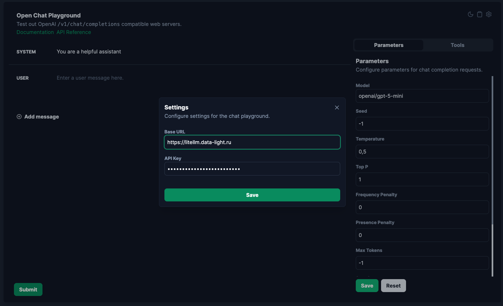
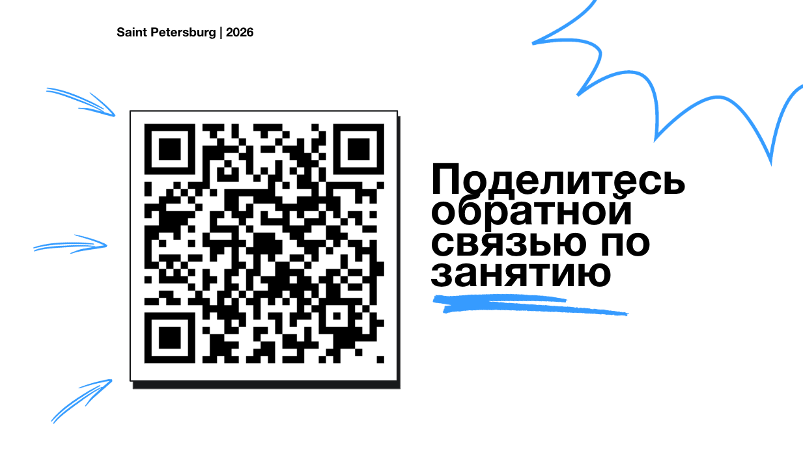

# Практика 01: От идеи до плана разработки с AI

---

## Инструменты для работы с AI

### Где использовать чат?

**Вариант 1: Онлайн (рекомендуется для начала)**

- Откройте: <https://abetlen.github.io/open-chat-playground/>
- Готово к использованию сразу

**Вариант 2: Локально**

- Репозиторий: <https://github.com/abetlen/open-chat-playground>
- Установка: `npm install` и `npm start`
- Полный контроль над настройками

Настройки:

- <https://litellm.data-light.ru>
- `openai/gpt-5-mini`



---

## Цель практики

Пройти путь **от идеи продукта до набора артефактов**

Бизнес-логика → Декомпозиция → Архитектура → Качество

---

## Рабочая тетрадь

Откройте файл: `practices/practice_01/task.py`

**Что открыть в `task.py`:**

- `STUDENT_INFO` — информация о группе
- `EVENT_STORMING` — результаты event storming
- `CJM` — Customer Journey Map
- `ROADMAP` — roadmap по версиям
- `EPICS` — список Epics
- `USER_STORIES` — User Stories
- `DEFINITION_OF_READY` — DoR
- `ARCHITECTURE_COMPONENTS` — компоненты системы
- `ADR` — Architecture Decision Record
- `MERMAID_CODE` — код Mermaid диаграммы
- `DEFINITION_OF_DONE` — DoD
- `TEST_PLAN` — план тестирования
- `FUNCTIONAL_DELIVERY` — Jira-тикеты
- `PROMPT_LOGS` — журнал всех промптов
- `REFLECTION` — рефлексия

После завершения запустите:

```bash
python3 task.py
```

Сформируется отчёт: `artifacts/report_p1.md`

---

## Проект: WeatherService

REST API сервис уведомлений о погоде:

- Подписка на города и управление подписками
- Получение текущей погоды/прогноза из внешнего Weather API
- Клиенты: веб/мобильные приложения

---

## Итоговые артефакты

- Event storming (light): actors/commands/events
- CJM: основной путь пользователя
- Roadmap: v1.0/v1.1/v2.0
- Epics + User Stories
- DoR (Definition of Ready)
- ADR + Mermaid (HLD)
- DoD + тест-план
- Functional Delivery: Jira-тикеты

---

## Структура практики

1. **Вступление**
2. **CJM и UX через event storming**
3. **ADR + HLD**
4. **QA + Functional Delivery**
5. **Демонстрация**
6. **Завершение**

---

## Задание 1: CJM и UX

**Цель:** формализовать идею в понятный путь пользователя

**Результат:**

- 5–7 events, 3–5 commands, 3–5 actors
- CJM на 6–8 шагов
- Roadmap v1.0/v1.1/v2.0
- 4–6 epics, 5–7 user stories
- DoR на 4–6 пунктов

**Куда писать:**
`EVENT_STORMING`, `CJM`, `ROADMAP`,
`EPICS`, `USER_STORIES`, `DEFINITION_OF_READY`

**Пример промпта для Event Storming:**

```
Контекст: WeatherService — REST API сервис 
уведомлений о погоде.
Задача: Проведи лёгкий event storming: 
перечисли 5–7 domain events, 3–5 commands 
и 3–5 actors.
Формат: Markdown с заголовками Actors, 
Commands, Domain Events.
```

**Пример промпта для CJM и Roadmap:**

```
Собери CJM (6–8 шагов) для сценария 
"подписка → уведомления" в WeatherService.
Затем предложи roadmap по версиям 
v1.0/v1.1/v2.0: что войдёт в каждую версию 
и почему.
```

**Пример промпта для Epics и User Stories:**

```
По нашему roadmap выдели 4–6 Epics и 
5–7 User Stories (формат: "Как [роль], 
я хочу [действие], чтобы [выгода]").
Также сделай Definition of Ready (DoR) 
чек-лист (4–6 пунктов) для задач команды.
```

---

## Задание 2: ADR + HLD

**Цель:** перейти от бизнес-артефактов к техническому решению

**Результат:**

- Краткий ADR (контекст/решение/альтернативы/последствия)
- Валидная Mermaid диаграмма с компонентами и связями

**Куда писать:**
`ARCHITECTURE_COMPONENTS`, `ADR`,
`MERMAID_CODE`, `MERMAID_IMAGE_URL`

**Инструмент:** <https://mermaid.live/>

**Пример промпта для ADR и Mermaid:**

```
Контекст: WeatherService — REST API.
Компоненты: Client (Web/Mobile), 
Backend (FastAPI), DB (PostgreSQL), 
External Weather API (OpenWeatherMap).
Задача:
1) Напиши ADR (кратко): Контекст, 
Решение, Альтернативы, 
Последствия/Trade-offs.
2) Сгенерируй Mermaid диаграмму 
компонентов (Client → Backend → 
DB/Weather API), отметь основные 
эндпоинты v1.0.
Формат: сначала ADR, затем Mermaid 
код в блоке ```mermaid.
```

---

## Задание 3: QA + Functional Delivery

**Цель:** сформировать профессиональную «нарезку на delivery»

**Результат:**

- DoD на 4–6 пунктов
- Тест-план: минимум 8 тест-кейсов (позитивные/негативные)
- 6–10 Jira-тикетов с AC и тестами

**Куда писать:**
`DEFINITION_OF_DONE`, `TEST_PLAN`,
`FUNCTIONAL_DELIVERY`

**Пример промпта для DoD:**

```
Теперь сделай Definition of Done чек-лист. 
Что мы должны проверить, прежде чем считать задачу выполненной?
```

**Пример промпта для тест-плана и тикетов:**

```
Сделай тест-план для v1.0 WeatherService: 
минимум 8 тест-кейсов (валидация JSON, 
ошибки внешнего API, таймауты, коды ответов, 
идемпотентность).
Затем нарежь работу на 6–10 Jira-тикетов 
(Title/Description/AC/Test cases/
Dependencies).
```

---

## Критерии оценки

| Критерий           | Баллы  |
| :----------------- | :----: |
| Полнота артефактов |   3    |
| Согласованность    |   2    |
| Качество промптов  |   2    |
| Рабочая схема      |   2    |
| Рефлексия          |   1    |
| **Всего**          | **10** |

---

## Домашнее задание

### Обязательно

- **LLD по одному Epic**: текст/схема + промпт
- **Улучшить DoR/DoD до версии 2.0**

### Со звёздочкой (\*)

- **Повторить весь цикл** для v2.0 из роадмапа

---

## Обратная связь



**Поделитесь обратной связью по занятию**

QR-код для быстрого доступа

---

## Удачи
