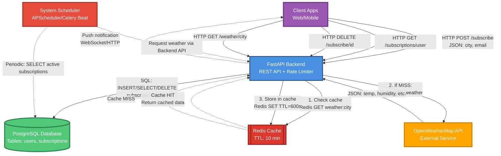

# Отчет по Практике 2: Алехина Ксения

## 1. Анализ промптов R.C.T.F.

### Задание 1: Улучшение архитектурной схемы (Mermaid v2)
**Role:** Ты Senior Backend Architect с опытом проектирования REST API и микросервисных систем.
**Context:** Мы разрабатываем WeatherService — REST API для уведомлений о погоде.
        
Текущая архитектура v1.0:
- Client Apps (Web/Mobile) → FastAPI Backend → PostgreSQL Database
- Backend синхронно вызывает OpenWeatherMap API для получения данных о погоде
- System Scheduler периодически проверяет подписки и отправляет уведомления

Проблемы v1.0:
- Каждый запрос погоды вызывает внешний API (лимиты, таймауты, деньги)
- Нет кэширования данных о погоде
- Не указаны протоколы взаимодействия между компонентами
- Недостаточно деталей о структуре БД

Требования для v2.0:
- Добавить Redis для кэширования данных о погоде (TTL 10 минут)
- Показать, как PostgreSQL хранит подписки (таблицы users, subscriptions)
- Указать протоколы взаимодействия (HTTP REST, Redis protocol)
- Добавить rate limiting для защиты API
**Task:** Улучши архитектурную схему до продакшен-уровня:
1. Добавь Redis Cache как отдельный компонент между Backend и Weather API
2. Покажи логику: Backend сначала проверяет Redis, если данных нет — идет в Weather API и кэширует результат
3. Укажи на связях протоколы (HTTP REST, Redis protocol)
4. Добавь детали о PostgreSQL (таблицы: users, subscriptions)
5. Покажи основные эндпоинты v1.0: POST /subscribe, GET /subscriptions/{user}, DELETE /subscribe/{id}, GET /weather/{city}
6. Используй разные формы для разных типов компонентов (прямоугольники для сервисов, цилиндры для БД, ромбы для кэша)
**Format:** Mermaid диаграмма компонентов (flowchart LR или TB).
Требования к схеме:
- Используй нотацию flowchart
- Для каждого компонента добавь краткое описание
- На связях укажи протоколы и основные операции
- Используй стили для визуального разделения компонентов (fill, stroke)
- Покажи потоки данных стрелками (сплошные для основных, пунктирные для фоновых процессов)
**Результат:** Создана детализированная Mermaid схема v2.0 с Redis кэшем, протоколами взаимодействия и основными эндпоинтами.
Добавлена логика кэширования: Backend → Redis (check) → Weather API (if miss) → Redis (store).
Указаны таблицы PostgreSQL и rate limiting. Схема валидна и рендерится в mermaid.live.
---
### Задание 2: Формализация требований в Gherkin
**Role:** Ты опытный QA Automation Engineer с 8-летним опытом в написании BDD-тестов и автоматизации для REST API.
**Context:** У нас есть User Stories из практики 1 для WeatherService — REST API для уведомлений о погоде.

User Story 1 (v1.0): "Как End User, я хочу подписаться на уведомления о погоде через POST /subscribe, чтобы получать актуальные оповещения для выбранного города."

Технический контекст:
- Система: REST API на Python (FastAPI)
- API погоды: OpenWeatherMap
- База данных: PostgreSQL (таблицы: users, subscriptions с полями: id, user_id, city, email, created_at)
- Кэширование: Redis (кэш данных о погоде с TTL 10 минут)

Пользовательский флоу через API:
1. Клиент отправляет POST /subscribe с JSON: {"city": "Moscow", "email": "user@test.com"}
2. API проверяет существование города через OpenWeatherMap (или Redis кэш)
3. API проверяет, нет ли уже подписки для этого email+city
4. API сохраняет подписку в PostgreSQL
5. API возвращает 201 Created с данными о погоде и ID подписки

Проблемы текущих User Stories:
- Слишком общие формулировки
- Нет конкретных критериев приёмки
- Не указаны edge cases (что если город не найден, email уже подписан, невалидный JSON)
**Task:** Преобразуй User Story 1 в детальные Acceptance Criteria в формате Gherkin.

Создай минимум 5 сценариев:
1. Позитивный: успешная подписка на существующий город
2. Позитивный: подписка с кэшированными данными о погоде (Redis HIT)
3. Негативный: город не найден в OpenWeatherMap API
4. Негативный: email уже подписан на этот город (дубликат)
5. Граничный случай: город с пробелами или спецсимволами в названии

Каждый сценарий должен покрывать:
- Предусловия (Given)
- Действие пользователя (When)
- Ожидаемый результат (Then)
- Дополнительные проверки (And)
**Format:** Gherkin синтаксис (.feature файл) с Feature, Scenario, Given/When/Then.

Структура:
Feature: [Название фичи]
  Background: [Общие предусловия для всех сценариев]
  
  Scenario: [Название позитивного сценария]
    Given [предусловие]
    And [дополнительное предусловие]
    When [действие]
    Then [ожидаемый результат]
    And [дополнительная проверка]

Требования:
- Используй строгий Gherkin-синтаксис (Given/When/Then/And/But)
- Формулировки должны быть понятны и разработчикам, и QA
- Избегай технических деталей реализации (не "вызов функции save_to_db", а "подписка сохранена в базе данных")
- Указывай конкретные HTTP коды ответов и структуру JSON
**Результат:** Созданы 5 детальных Gherkin сценариев для фичи подписки на погоду через REST API.
Покрыты позитивные кейсы (успешная подписка, кэш), негативные (город не найден, дубликат email) и граничный случай (спецсимволы в названии города).
Все сценарии следуют строгому Gherkin-синтаксису с Given/When/Then и содержат конкретные проверки HTTP кодов и JSON структуры.
---
### Задание 3.1: Улучшение Definition of Ready (DoR v2.0)
**Role:** Ты опытный Product Owner с 5-летним опытом в Agile/Scrum и управлении бэклогом продуктов.
**Context:** Мы разрабатываем WeatherService — REST API для уведомлений о погоде.

Наш текущий Definition of Ready v1.0:
- Описание задачи с бизнес-целями и критериями приёмки (AC)
- Приложены mock-ups / примеры запросов и ожидаемые JSON-ответы
- Указаны зависимости (внешние API, очереди) и план их обработки
- Оценка трудоёмкости (Story points / время) и назначен ответственный исполнитель
- Наличие тест-кейсов или набросков тест-плана

Проблемы v1.0:
- Слишком общий и неструктурированный
- Нет разделения по категориям (требования, техника, дизайн, тестирование)
- Недостаточно специфики для REST API проекта
- Не хватает пунктов про безопасность, производительность, документацию
**Task:** Создай улучшенную версию Definition of Ready v2.0, структурированную по категориям.

Требования:
1. Раздели DoR на 5 категорий: Requirements, Technical, Design, Testing, Documentation
2. Каждая категория должна содержать 3-5 конкретных пунктов
3. Добавь специфику для REST API проекта (эндпоинты, JSON контракты, HTTP коды)
4. Включи пункты про безопасность (аутентификация, валидация входных данных)
5. Добавь требования к производительности и масштабируемости
6. Убедись, что каждый пункт проверяем (можно ответить да/нет)
**Format:** Структурированный чек-лист в Markdown.

Формат:
## Definition of Ready v2.0

### Requirements (Требования)
- [ ] Пункт 1
- [ ] Пункт 2
...

### Technical (Технические аспекты)
- [ ] Пункт 1
...

### Design (Дизайн API/контракты)
- [ ] Пункт 1
...

### Testing (Тестирование)
- [ ] Пункт 1
...

### Documentation (Документация)
- [ ] Пункт 1
...

Каждый пункт должен быть конкретным и проверяемым.
**Результат:** Создан структурированный DoR v2.0 с 5 категориями и 18 пунктами.
Добавлена специфика для REST API: JSON контракты, HTTP коды, валидация входных данных.
Включены требования к безопасности (rate limiting, input validation), производительности (SLA, нагрузка) и документации (Swagger/OpenAPI).
Все пункты проверяемы и конкретны для WeatherService проекта.
---
### Задание 3.2: Улучшение Definition of Done (DoD v2.0)
**Role:** Ты опытный Scrum Master с опытом в DevOps, CI/CD и обеспечении качества кода.
**Context:** Мы разрабатываем WeatherService — REST API для уведомлений о погоде.

Наш текущий Definition of Done v1.0:
- Код написан, прошёл code review и соответствует стандартам проекта (PEP8, type hints)
- Все unit-тесты написаны и проходят успешно (coverage минимум 80%)
- Интеграционные тесты для эндпоинтов выполнены и задокументированы
- Документация обновлена (API endpoints в Swagger/OpenAPI, README)
- Задача задеплоена в тестовое окружение и проверена вручную (smoke test)

Проблемы v1.0:
- Недостаточно деталей и структуры
- Нет разделения по категориям
- Не хватает пунктов про безопасность, мониторинг, откат изменений
- Нет требований к логированию и метрикам
**Task:** Создай улучшенную версию Definition of Done v2.0, структурированную по категориям.

Требования:
1. Раздели DoD на 5 категорий: Code, Tests, Documentation, Review, Deployment
2. Каждая категория должна содержать 3-5 конкретных пунктов
3. Добавь требования к безопасности (security scan, валидация)
4. Включи пункты про мониторинг, логирование и метрики
5. Добавь требования к откату изменений (rollback plan)
6. Убедись, что каждый пункт проверяем
**Format:** Структурированный чек-лист в Markdown.

Формат:
## Definition of Done v2.0

### Code (Код)
- [ ] Пункт 1
- [ ] Пункт 2
...

### Tests (Тесты)
- [ ] Пункт 1
...

### Documentation (Документация)
- [ ] Пункт 1
...

### Review (Код-ревью)
- [ ] Пункт 1
...

### Deployment (Деплой)
- [ ] Пункт 1
...

Каждый пункт должен быть конкретным и проверяемым.
**Результат:** Создан структурированный DoD v2.0 с 5 категориями и 20 пунктами.
Добавлены требования к безопасности (security scan, input validation), мониторингу (метрики, алерты) и логированию.
Включены пункты про откат изменений (rollback plan), performance testing и smoke tests в staging.
Все пункты проверяемы и готовы к использованию командой.
---
### Задание 4: Структурированный тест-план v2.0
**Role:** Ты Senior QA Engineer с 10-летним опытом в тестировании REST API и микросервисов.
**Context:** Мы готовимся к тестированию WeatherService — REST API для уведомлений о погоде.

Текущий тест-план v1.0 содержит 10 тест-кейсов, но они не структурированы по уровням тестирования.

Компоненты системы для тестирования:
- REST API endpoints (FastAPI роутеры)
- Weather API client (получение погоды через httpx)
- Database layer (PostgreSQL через asyncpg)
- Redis cache service (кэширование данных)
- Subscription service (бизнес-логика подписок)
- Validation layer (Pydantic модели)

Технологии тестирования:
- Unit: pytest, pytest-asyncio
- Integration: pytest, testcontainers (для Redis, PostgreSQL)
- E2E: pytest, httpx (тестирование HTTP endpoints)
**Task:** Создай комплексный тест-план для фичи подписки на погоду, структурированный по пирамиде тестирования.

Требования:
1. Минимум 12 тест-кейсов: ~50% unit, ~30% integration, ~20% e2e
2. Каждый тест-кейс должен содержать: ID, Level, Component, Description, Preconditions, Steps, Expected Result
3. Покрыть позитивные, негативные и граничные случаи
4. Включить тесты для кэширования (Redis), валидации, работы с БД, внешнего API
**Format:** Markdown таблица с колонками: Test ID | Level | Component | Description | Preconditions | Steps | Expected Result

Формат ID: TC-001, TC-002, ...
Level: Unit/Integration/E2E
Component: конкретный модуль/сервис
**Результат:** Создан структурированный тест-план v2.0 с 12 тест-кейсами, распределёнными по пирамиде тестирования (6 unit, 4 integration, 2 e2e).
Покрыты все критические компоненты: валидация, кэширование, БД, внешний API, эндпоинты.
Включены позитивные, негативные и граничные сценарии.
---
### Задание 5: Улучшение Functional Delivery v2.0
**Role:** Ты Senior Delivery Manager с опытом в Agile и управлении бэклогом продуктов.
**Context:** У нас есть базовые Jira-тикеты для WeatherService v1.0 из Практики 1.

Проблемы текущих тикетов:
- Acceptance Criteria недостаточно детальные (нет формата Given/When/Then)
- Нет зависимостей между тикетами
- Нет приоритетов (High/Medium/Low)
- Нет оценок времени (story points или часы)
- Тест-кейсы слишком общие (только ссылки на TC1, TC2)

Нужно улучшить 3-4 ключевых тикета для v1.0.
**Task:** Улучши следующие тикеты до профессионального уровня:
1. POST /subscribe
2. GET /weather/{city}
3. Redis кэширование

Для каждого тикета добавь:
- Детальные Acceptance Criteria в формате Given/When/Then
- Зависимости от других тикетов
- Приоритет (High/Medium/Low)
- Оценку времени (story points: 1, 2, 3, 5, 8)
- Детальные тест-кейсы с конкретными шагами
**Format:** Структурированный список тикетов в Markdown.

Каждый тикет:
**Title:** [название]
**Description:** [описание]
**Priority:** High/Medium/Low
**Estimate:** X story points
**Acceptance Criteria:**
- Given [предусловие]
- When [действие]
- Then [результат]
**Test Cases:** [детальные тест-кейсы]
**Dependencies:** [зависимости]
**Результат:** Улучшены 3 Jira-тикета с полной детализацией.
Добавлены AC в формате Given/When/Then, приоритеты (все High для v1.0), оценки (2-5 SP), детальные тест-кейсы и зависимости.
Тикеты готовы к оценке командой и взятию в работу.
---
### Homework: Chain of Thought - Шаг 1 (Схема БД)
**Role:** Ты Database Architect с опытом проектирования реляционных БД для веб-приложений.
**Context:** WeatherService — REST API для уведомлений о погоде.
        
Нужно спроектировать структуру данных для хранения пользователей и их подписок на города.

Требования к данным:
- Пользователи: email (уникальный), дата регистрации
- Подписки: связь с пользователем, название города, время уведомления, статус активности
- Один пользователь может иметь несколько подписок
- Один пользователь не может подписаться на один город дважды
**Task:** Спроектируй структуру базы данных PostgreSQL для хранения подписок на погоду.

Требования:
- Таблица users: хранит информацию о пользователях (id, email, created_at)
- Таблица subscriptions: хранит подписки на города (id, user_id, city, notification_time, is_active, created_at)
- Связь: один пользователь может иметь несколько подписок
- Нужны индексы для быстрого поиска по email и city
- Constraint: email должен быть уникальным, подписка на один город для одного пользователя должна быть уникальной
**Format:** Markdown таблицы с описанием структуры БД.

Формат:
#### Таблица: [название]
| Поле | Тип | Описание | Constraints |
|------|-----|----------|-------------|

#### Связи
[описание связей между таблицами]

#### Индексы
[список индексов с обоснованием]
**Результат:** Создана схема БД с двумя таблицами (users, subscriptions), связью ONE-TO-MANY, индексами для оптимизации запросов и constraints для целостности данных.
Схема готова для использования в следующем шаге (генерация Pydantic моделей).
---
### Homework: Chain of Thought - Шаг 2 (Pydantic модели)
**Role:** Ты Senior Backend Developer с опытом разработки REST API на Python FastAPI.
**Context:** WeatherService — REST API для уведомлений о погоде.

Схема БД уже спроектирована (из предыдущего шага):
- users: id (SERIAL), email (VARCHAR UNIQUE), created_at (TIMESTAMP)
- subscriptions: id (SERIAL), user_id (INTEGER FK), city (VARCHAR), notification_time (TIME), is_active (BOOLEAN), created_at (TIMESTAMP)

Нужно создать Pydantic модели для валидации данных в FastAPI эндпоинтах.
**Task:** На основе схемы БД напиши Pydantic модели для FastAPI:

Требования:
- Модели для создания (Create): без id и created_at (генерируются БД)
- Модели для ответа (Response): со всеми полями
- Модель для обновления (Update): опциональные поля
- Валидация: email должен быть валидным (EmailStr), city минимум 2 символа, notification_time в формате HH:MM
- Используй Field для описания полей и валидации
**Format:** Python код с Pydantic моделями.

Структура:
```python
from pydantic import BaseModel, EmailStr, Field
from datetime import datetime, time
from typing import Optional

class [Model]Create(BaseModel):
    # поля для создания
    
class [Model]Response(BaseModel):
    # все поля
    class Config:
        from_attributes = True

class [Model]Update(BaseModel):
    # опциональные поля для обновления
```

Требования:
- Используй type hints
- Добавь валидацию через Field
- Добавь docstrings к моделям
**Результат:** Созданы Pydantic модели для User и Subscription (Create/Response/Update).
Модели соответствуют схеме БД из предыдущего шага: типы данных согласованы (VARCHAR → str, SERIAL → int, TIMESTAMP → datetime).
Добавлена валидация: EmailStr для email, Field с min_length для city, default значения для notification_time и is_active.
Модели готовы для использования в FastAPI эндпоинтах.
---
### Homework: Chain of Thought - Шаг 3 (SQL-скрипт)
**Role:** Ты Database Administrator с опытом настройки PostgreSQL для production-окружений.
**Context:** WeatherService — REST API для уведомлений о погоде.

Схема БД спроектирована (Шаг 1):
- users: id (SERIAL PK), email (VARCHAR UNIQUE NOT NULL), created_at (TIMESTAMP DEFAULT NOW)
- subscriptions: id (SERIAL PK), user_id (INTEGER FK → users.id NOT NULL), city (VARCHAR NOT NULL), notification_time (TIME DEFAULT '09:00'), is_active (BOOLEAN DEFAULT TRUE), created_at (TIMESTAMP DEFAULT NOW)

Индексы:
- idx_users_email на users(email)
- idx_subscriptions_user_id на subscriptions(user_id)
- idx_subscriptions_city на subscriptions(city)
- unique_user_city UNIQUE на subscriptions(user_id, city)

Нужно создать SQL-скрипт для развертывания БД.
**Task:** Напиши SQL-скрипт для создания этих таблиц в PostgreSQL.

Требования:
- Создать таблицы users и subscriptions с полями из схемы
- Добавить все индексы для оптимизации запросов
- Добавить ON DELETE CASCADE для внешнего ключа (при удалении пользователя удаляются его подписки)
- Добавить комментарии к таблицам и полям для документации
- Скрипт должен быть готов к выполнению (без ошибок синтаксиса)
**Format:** SQL-скрипт готовый к выполнению в PostgreSQL.

Структура:
```sql
-- Комментарий к таблице
CREATE TABLE [название] (
    поле тип constraints,
    ...
    CONSTRAINT [название] ...
);

COMMENT ON TABLE [название] IS 'описание';
COMMENT ON COLUMN [название].[поле] IS 'описание';

CREATE INDEX [название] ON [таблица]([поле]);
```

Требования:
- Используй SERIAL для автоинкремента
- Добавь DEFAULT для timestamp полей
- Используй CONSTRAINT для именованных ограничений
- Добавь комментарии для документации
**Результат:** Создан SQL-скрипт для развертывания БД WeatherService.
Скрипт включает: создание таблиц users и subscriptions, внешний ключ с ON DELETE CASCADE, индексы для оптимизации, комментарии к таблицам и полям.
Скрипт валиден и готов к выполнению в PostgreSQL.
Все три шага Chain of Thought согласованы: схема БД → Pydantic модели → SQL-скрипт используют одинаковые названия полей и типы данных.
---
## 2. Улучшенные артефакты

### Mermaid v2


### Gherkin Scenarios
```gherkin

Feature: Weather Subscription API
  Управление подписками на уведомления о погоде через REST API

  Background:
    Given API сервис WeatherService запущен и доступен
    And PostgreSQL база данных содержит таблицы users и subscriptions
    And Redis кэш доступен для хранения данных о погоде
    And OpenWeatherMap API доступен для получения данных о погоде

  Scenario: Успешная подписка на уведомления для существующего города
    Given клиент имеет валидный API endpoint POST /subscribe
    And email "user@test.com" не подписан на уведомления для города "Moscow"
    And город "Moscow" существует в OpenWeatherMap API
    When клиент отправляет POST запрос на /subscribe с JSON {"city": "Moscow", "email": "user@test.com"}
    Then API проверяет существование города через OpenWeatherMap API
    And API сохраняет подписку в таблицу subscriptions базы данных PostgreSQL
    And API возвращает HTTP статус 201 Created
    And ответ содержит JSON с полями: subscription_id, city, email, weather
    And данные о погоде для города "Moscow" кэшируются в Redis с TTL 600 секунд

  Scenario: Успешная подписка с использованием кэшированных данных о погоде
    Given клиент имеет валидный API endpoint POST /subscribe
    And email "newuser@test.com" не подписан на уведомления для города "London"
    And данные о погоде для города "London" уже закэшированы в Redis
    When клиент отправляет POST запрос на /subscribe с JSON {"city": "London", "email": "newuser@test.com"}
    Then API проверяет наличие данных в Redis кэше
    And API НЕ вызывает OpenWeatherMap API (используется кэш)
    And API сохраняет подписку в базу данных
    And API возвращает HTTP статус 201 Created
    And ответ содержит закэшированные данные о погоде для "London"

  Scenario: Ошибка при подписке на несуществующий город
    Given клиент имеет валидный API endpoint POST /subscribe
    And город "NonExistentCity123" не существует в OpenWeatherMap API
    When клиент отправляет POST запрос на /subscribe с JSON {"city": "NonExistentCity123", "email": "user@test.com"}
    Then API пытается проверить город через OpenWeatherMap API
    And OpenWeatherMap API возвращает ошибку 404 Not Found
    And API НЕ сохраняет подписку в базу данных
    And API возвращает HTTP статус 404 Not Found
    And ответ содержит JSON с сообщением об ошибке: "City not found"

  Scenario: Ошибка при попытке создать дубликат подписки
    Given клиент имеет валидный API endpoint POST /subscribe
    And email "existing@test.com" уже подписан на уведомления для города "Paris"
    When клиент отправляет POST запрос на /subscribe с JSON {"city": "Paris", "email": "existing@test.com"}
    Then API проверяет существующие подписки в базе данных
    And API обнаруживает дубликат подписки для email "existing@test.com" и города "Paris"
    And API НЕ создаёт новую подписку
    And API возвращает HTTP статус 409 Conflict
    And ответ содержит JSON с сообщением: "Subscription already exists for this email and city"

  Scenario: Подписка на город с пробелами и спецсимволами в названии
    Given клиент имеет валидный API endpoint POST /subscribe
    And город "Saint-Petersburg" существует в OpenWeatherMap API
    When клиент отправляет POST запрос на /subscribe с JSON {"city": "Saint-Petersburg", "email": "user@test.com"}
    Then API корректно обрабатывает название города с дефисом
    And API проверяет город через OpenWeatherMap API с URL-кодированием
    And API сохраняет подписку с названием города "Saint-Petersburg"
    And API возвращает HTTP статус 201 Created
    And ответ содержит корректные данные о погоде для "Saint-Petersburg"

```

### DoR v2.0

## Definition of Ready v2.0

### Requirements (Требования)
- [ ] User Story сформулирована в формате "Как [роль], я хочу [действие], чтобы [выгода]"
- [ ] Описаны бизнес-цели и ценность для пользователя
- [ ] Acceptance Criteria написаны в формате Gherkin (Given/When/Then) с минимум 3 сценариями
- [ ] Определены приоритет (High/Medium/Low) и версия релиза (v1.0/v1.1/v2.0)

### Technical (Технические аспекты)
- [ ] Указаны все зависимости: внешние API (OpenWeatherMap), базы данных (PostgreSQL), кэш (Redis)
- [ ] Определены технические ограничения: таймауты (5 сек для Weather API), rate limits (100 req/min)
- [ ] Оценена трудоёмкость в story points или часах
- [ ] Назначен ответственный исполнитель (developer) и reviewer

### Design (Дизайн API/контракты)
- [ ] Определены HTTP эндпоинты с методами (POST /subscribe, GET /weather/{city})
- [ ] Описаны JSON контракты запросов и ответов с примерами
- [ ] Указаны HTTP коды ответов для всех сценариев (200, 201, 400, 404, 409, 500, 503)
- [ ] Определена схема данных в PostgreSQL (таблицы, поля, индексы)

### Testing (Тестирование)
- [ ] Написан план тестирования с минимум 5 тест-кейсами (unit, integration, e2e)
- [ ] Определены edge cases и негативные сценарии
- [ ] Указаны требования к test coverage (минимум 80% для unit-тестов)

### Documentation (Документация)
- [ ] Подготовлены примеры API запросов для Swagger/OpenAPI документации
- [ ] Описаны требования к логированию (что логировать, уровни: INFO, ERROR)
- [ ] Определены метрики для мониторинга (latency, error rate, cache hit rate)


### DoD v2.0

## Definition of Done v2.0

### Code (Код)
- [ ] Код написан и соответствует стандартам проекта (PEP8, type hints, docstrings)
- [ ] Все функции и классы имеют type annotations
- [ ] Нет hardcoded значений (используются environment variables или config)
- [ ] Код оптимизирован: нет дублирования, используются async/await для I/O операций
- [ ] Security scan пройден: нет SQL injection, XSS, hardcoded secrets

### Tests (Тесты)
- [ ] Unit-тесты написаны и проходят успешно (coverage минимум 80%)
- [ ] Integration тесты для всех API эндпоинтов выполнены
- [ ] E2E тесты для критических флоу (подписка → уведомление) пройдены
- [ ] Негативные сценарии покрыты тестами (404, 409, 503 ошибки)
- [ ] Performance тесты выполнены: API отвечает за < 500ms при нагрузке 100 req/min

### Documentation (Документация)
- [ ] API endpoints задокументированы в Swagger/OpenAPI с примерами запросов/ответов
- [ ] README обновлён: инструкции по запуску, переменные окружения, зависимости
- [ ] Добавлены комментарии к сложным участкам кода
- [ ] Changelog обновлён с описанием изменений

### Review (Код-ревью)
- [ ] Code review пройден минимум одним senior разработчиком
- [ ] Все комментарии из code review исправлены
- [ ] Нет критических замечаний от reviewer
- [ ] Архитектурные решения согласованы с tech lead

### Deployment (Деплой)
- [ ] Задача задеплоена в staging окружение
- [ ] Smoke tests в staging пройдены успешно
- [ ] Логирование работает: логи пишутся в stdout/stderr и собираются в centralized logging
- [ ] Метрики настроены: latency, error rate, cache hit rate отображаются в Grafana
- [ ] Rollback plan подготовлен: описаны шаги отката изменений в случае проблем


### Test Plan v2

## Тест-план v2.0 (структурированный по пирамиде тестирования)

| Test ID | Level | Component | Description | Preconditions | Steps | Expected Result |
|---------|-------|-----------|-------------|---------------|-------|-----------------|
| TC-001 | Unit | Validation Layer | Валидация города в Pydantic модели | Pydantic модель SubscriptionRequest | 1. Создать модель с city="Moscow" 2. Валидировать | Валидация успешна, city="Moscow" |
| TC-002 | Unit | Validation Layer | Валидация невалидного email | Pydantic модель SubscriptionRequest | 1. Создать модель с email="invalid" 2. Валидировать | ValidationError: invalid email format |
| TC-003 | Unit | Cache Service | Проверка кэширования данных о погоде | Redis mock, weather_data | 1. Сохранить данные в кэш с TTL=600 2. Получить данные | Данные возвращены из кэша, TTL=600 |
| TC-004 | Unit | Cache Service | Проверка cache miss | Redis mock, пустой кэш | 1. Запросить данные для города "Paris" | Возвращен None (cache miss) |
| TC-005 | Unit | Subscription Service | Проверка дубликата подписки | БД mock с существующей подпиской | 1. Попытаться создать подписку для email+city 2. Проверить дубликат | Возвращен False (дубликат найден) |
| TC-006 | Unit | Weather API Client | Обработка таймаута Weather API | httpx mock с timeout | 1. Вызвать get_weather("London") 2. Симулировать timeout | Raise TimeoutException |
| TC-007 | Integration | Database + Subscription Service | Создание подписки в PostgreSQL | PostgreSQL testcontainer | 1. Создать подписку через service 2. Проверить запись в БД | Подписка сохранена, id > 0 |
| TC-008 | Integration | Redis + Weather API Client | Кэширование данных из Weather API | Redis testcontainer, Weather API mock | 1. Запросить погоду для "Berlin" 2. Проверить кэш 3. Повторный запрос | 1-й запрос: API вызван, данные в кэше 2-й запрос: API не вызван, данные из кэша |
| TC-009 | Integration | Database + API Endpoints | Получение списка подписок пользователя | PostgreSQL с 3 подписками для user_id=1 | 1. GET /subscriptions/1 | 200 OK, JSON с 3 подписками |
| TC-010 | Integration | Weather API + Error Handling | Обработка 404 от Weather API | Weather API mock с 404 | 1. POST /subscribe с city="InvalidCity" | 404 Not Found, message="City not found" |
| TC-011 | E2E | Full Flow | Полный флоу: подписка → получение погоды | Все сервисы запущены | 1. POST /subscribe {"city":"Moscow","email":"test@test.com"} 2. GET /weather/Moscow | 1. 201 Created, subscription_id 2. 200 OK, weather data |
| TC-012 | E2E | Full Flow | Полный флоу с ошибкой дубликата | Существующая подписка в БД | 1. POST /subscribe с существующим email+city | 409 Conflict, message="Subscription already exists" |


### Functional Delivery v2.0

### Тикет 1: Реализовать эндпоинт POST /subscribe

**Title:** [WS-101] Реализовать эндпоинт POST /subscribe для создания подписки на уведомления о погоде

**Description:**
Создать REST API эндпоинт для подписки пользователя на уведомления о погоде в указанном городе. Эндпоинт должен валидировать входные данные, проверять существование города через OpenWeatherMap API, сохранять подписку в PostgreSQL и возвращать данные о погоде.

**Priority:** High (критично для v1.0 MVP)

**Estimate:** 5 story points

**Acceptance Criteria:**
- Given клиент отправляет POST запрос на /subscribe с валидным JSON {"city": "Moscow", "email": "user@test.com"}
- When API получает запрос
- Then API валидирует поля (city: обязательно, email: обязательно и валидный формат)
- And API проверяет существование города через OpenWeatherMap API
- And API проверяет отсутствие дубликата подписки (email + city)
- And API сохраняет подписку в таблицу subscriptions PostgreSQL
- And API возвращает 201 Created с JSON: {"subscription_id": 1, "city": "Moscow", "email": "user@test.com", "weather": {...}}

**Негативные сценарии:**
- Given невалидный email
- Then возвращает 400 Bad Request с сообщением "Invalid email format"
- Given город не существует в OpenWeatherMap API
- Then возвращает 404 Not Found с сообщением "City not found"
- Given дубликат подписки (email + city уже существует)
- Then возвращает 409 Conflict с сообщением "Subscription already exists"

**Test Cases:**
1. Позитивный: POST /subscribe с {"city":"Moscow","email":"test@test.com"} → 201 Created, подписка в БД
2. Негативный: POST /subscribe с {"city":"Moscow","email":"invalid"} → 400 Bad Request
3. Негативный: POST /subscribe с {"city":"InvalidCity","email":"test@test.com"} → 404 Not Found
4. Негативный: POST /subscribe с дубликатом → 409 Conflict
5. Граничный: POST /subscribe с {"city":"Saint-Petersburg"} (спецсимволы) → 201 Created

**Dependencies:**
- PostgreSQL БД настроена и доступна
- Таблица subscriptions создана (поля: id, email, city, created_at)
- OpenWeatherMap API ключ настроен в environment variables
- Pydantic модели для валидации созданы

---

### Тикет 2: Реализовать эндпоинт GET /weather/{city} с кэшированием

**Title:** [WS-102] Реализовать эндпоинт GET /weather/{city} с Redis кэшированием

**Description:**
Создать REST API эндпоинт для получения данных о погоде для указанного города. Эндпоинт должен сначала проверять наличие данных в Redis кэше, и только при cache miss вызывать OpenWeatherMap API. Данные кэшируются с TTL 10 минут (600 секунд).

**Priority:** High (критично для v1.0 MVP)

**Estimate:** 3 story points

**Acceptance Criteria:**
- Given клиент отправляет GET запрос на /weather/Moscow
- When API получает запрос
- Then API проверяет наличие данных в Redis кэше по ключу "weather:Moscow"
- And если данные в кэше (cache HIT): возвращает данные из Redis без вызова Weather API
- And если данных нет (cache MISS): вызывает OpenWeatherMap API, сохраняет результат в Redis с TTL=600s, возвращает данные
- And API возвращает 200 OK с JSON: {"city": "Moscow", "temp": 15, "humidity": 60, "description": "clear sky"}

**Негативные сценарии:**
- Given город не найден в OpenWeatherMap API
- Then возвращает 404 Not Found с сообщением "City not found"
- Given OpenWeatherMap API недоступен (timeout)
- Then возвращает 503 Service Unavailable с сообщением "Weather service temporarily unavailable"

**Test Cases:**
1. Позитивный (cache MISS): GET /weather/London → вызов Weather API, данные в кэше, 200 OK
2. Позитивный (cache HIT): повторный GET /weather/London → данные из кэша, Weather API не вызван, 200 OK
3. Негативный: GET /weather/InvalidCity → 404 Not Found
4. Негативный: GET /weather/Moscow при недоступности Weather API → 503 Service Unavailable
5. Граничный: GET /weather/Moscow после истечения TTL (>600s) → cache MISS, новый вызов API

**Dependencies:**
- Redis сервер настроен и доступен
- OpenWeatherMap API ключ настроен
- Retry логика для вызовов Weather API реализована (3 попытки с экспоненциальной задержкой)
- Таймаут для Weather API установлен (5 секунд)

---

### Тикет 3: Настроить Redis кэширование для данных о погоде

**Title:** [WS-103] Настроить Redis кэш для хранения данных о погоде с TTL

**Description:**
Настроить Redis клиент для кэширования данных о погоде. Реализовать сервис кэширования с методами get/set и автоматическим TTL. Обеспечить graceful degradation при недоступности Redis (логировать ошибку, продолжать работу без кэша).

**Priority:** High (блокирует WS-102)

**Estimate:** 2 story points

**Acceptance Criteria:**
- Given Redis сервер доступен
- When сервис кэширования вызывает set("weather:Moscow", data, ttl=600)
- Then данные сохраняются в Redis с TTL 600 секунд
- And при вызове get("weather:Moscow") возвращаются сохранённые данные
- And после истечения TTL get("weather:Moscow") возвращает None

**Graceful degradation:**
- Given Redis сервер недоступен
- When сервис пытается вызвать get/set
- Then логируется ошибка WARNING "Redis unavailable, skipping cache"
- And метод возвращает None (для get) или игнорирует ошибку (для set)
- And приложение продолжает работу без кэша

**Test Cases:**
1. Unit: Сохранение данных в Redis с TTL → данные доступны в течение TTL
2. Unit: Получение данных из Redis → возвращаются корректные данные
3. Unit: Получение данных после истечения TTL → возвращается None
4. Integration: Redis недоступен → логируется ошибка, приложение работает
5. Integration: Кэширование данных о погоде для "Berlin" → данные сохранены и доступны

**Dependencies:**
- Redis сервер установлен и запущен (Docker container или cloud service)
- redis-py библиотека установлена (requirements.txt)
- Environment variable REDIS_URL настроена

---

### Тикет 4: Добавить обработку ошибок и retry логику для OpenWeatherMap API

**Title:** [WS-104] Реализовать retry логику и обработку ошибок для вызовов OpenWeatherMap API

**Description:**
Добавить retry логику (3 попытки с экспоненциальной задержкой) для вызовов OpenWeatherMap API при таймаутах или ошибках 5xx. Обеспечить корректную обработку ошибок 4xx (город не найден) без retry.

**Priority:** Medium (улучшает надежность)

**Estimate:** 2 story points

**Acceptance Criteria:**
- Given вызов OpenWeatherMap API завершился таймаутом
- When сервис обрабатывает ошибку
- Then выполняется retry (до 3 попыток) с экспоненциальной задержкой (1s, 2s, 4s)
- And логируется каждая попытка
- And после исчерпания попыток возвращается 503 Service Unavailable

**Обработка 4xx ошибок:**
- Given OpenWeatherMap API возвращает 404 (город не найден)
- Then retry НЕ выполняется
- And сразу возвращается 404 Not Found клиенту

**Test Cases:**
1. Unit: Таймаут Weather API → 3 retry с задержками 1s, 2s, 4s → 503 Service Unavailable
2. Unit: Weather API возвращает 500 → 3 retry → 503 Service Unavailable
3. Unit: Weather API возвращает 404 → retry НЕ выполняется → 404 Not Found
4. Integration: Симуляция таймаута → логируются все попытки → финальная ошибка 503
5. Integration: Успешный вызов после 2-й попытки → 200 OK с данными

**Dependencies:**
- httpx библиотека с поддержкой retry (или tenacity для retry логики)
- Логирование настроено (structlog или logging)


## 3. Домашнее задание

### Chain of Thought
**Задача:** 
Спроектировать полную структуру данных для WeatherService: от схемы БД до готового SQL-скрипта и Pydantic моделей для FastAPI.


**Шаги:** 
1. Спроектировать схему БД PostgreSQL (таблицы users, subscriptions с полями, типами, связями)
2. На основе схемы БД создать Pydantic модели для валидации данных в FastAPI
3. Написать SQL-скрипт для создания таблиц с индексами и constraints


**Последовательность:** 
### Промпт 1: Проектирование схемы БД

**Промпт:**
```
Спроектируй структуру базы данных PostgreSQL для хранения подписок на погоду.

Требования:
- Таблица users: хранит информацию о пользователях (id, email, created_at)
- Таблица subscriptions: хранит подписки на города (id, user_id, city, notification_time, is_active, created_at)
- Связь: один пользователь может иметь несколько подписок
- Нужны индексы для быстрого поиска по email и city
- Constraint: email должен быть уникальным, подписка на один город для одного пользователя должна быть уникальной

Формат: Markdown с описанием таблиц, полей, типов данных, связей и индексов.
```

**Результат:**

#### Таблица: users
| Поле | Тип | Описание | Constraints |
|------|-----|----------|-------------|
| id | SERIAL | Первичный ключ | PRIMARY KEY |
| email | VARCHAR(255) | Email пользователя | UNIQUE, NOT NULL |
| created_at | TIMESTAMP | Дата регистрации | DEFAULT CURRENT_TIMESTAMP |

#### Таблица: subscriptions
| Поле | Тип | Описание | Constraints |
|------|-----|----------|-------------|
| id | SERIAL | Первичный ключ | PRIMARY KEY |
| user_id | INTEGER | ID пользователя | FOREIGN KEY (users.id), NOT NULL |
| city | VARCHAR(100) | Название города | NOT NULL |
| notification_time | TIME | Время уведомления | DEFAULT '09:00:00' |
| is_active | BOOLEAN | Активна ли подписка | DEFAULT TRUE |
| created_at | TIMESTAMP | Дата создания | DEFAULT CURRENT_TIMESTAMP |

#### Связи
- subscriptions.user_id → users.id (ONE-TO-MANY)

#### Индексы
- idx_users_email: INDEX ON users(email) — быстрый поиск пользователя по email
- idx_subscriptions_user_id: INDEX ON subscriptions(user_id) — быстрый поиск подписок пользователя
- idx_subscriptions_city: INDEX ON subscriptions(city) — быстрый поиск подписок по городу
- unique_user_city: UNIQUE CONSTRAINT ON subscriptions(user_id, city) — один пользователь не может подписаться на один город дважды

---

### Промпт 2: Создание Pydantic моделей

**Промпт:**
```
На основе этой схемы БД напиши Pydantic модели для FastAPI:

Схема БД:
- users: id (SERIAL), email (VARCHAR UNIQUE), created_at (TIMESTAMP)
- subscriptions: id (SERIAL), user_id (INTEGER FK), city (VARCHAR), notification_time (TIME), is_active (BOOLEAN), created_at (TIMESTAMP)

Требования:
- Модели для создания (Create): без id и created_at
- Модели для ответа (Response): со всеми полями
- Валидация: email должен быть валидным, city минимум 2 символа, notification_time в формате HH:MM
- Используй EmailStr из pydantic для валидации email

Формат: Python код с Pydantic моделями.
```

**Результат:**

```python
from pydantic import BaseModel, EmailStr, Field
from datetime import datetime, time
from typing import Optional

# User models
class UserCreate(BaseModel):
    email: EmailStr

class UserResponse(BaseModel):
    id: int
    email: str
    created_at: datetime
    
    class Config:
        from_attributes = True

# Subscription models
class SubscriptionCreate(BaseModel):
    user_id: int = Field(gt=0, description="ID пользователя")
    city: str = Field(min_length=2, max_length=100, description="Название города")
    notification_time: time = Field(default=time(9, 0), description="Время уведомления")
    is_active: bool = Field(default=True, description="Активна ли подписка")

class SubscriptionResponse(BaseModel):
    id: int
    user_id: int
    city: str
    notification_time: time
    is_active: bool
    created_at: datetime
    
    class Config:
        from_attributes = True

class SubscriptionUpdate(BaseModel):
    city: Optional[str] = Field(None, min_length=2, max_length=100)
    notification_time: Optional[time] = None
    is_active: Optional[bool] = None
```

---

### Промпт 3: SQL-скрипт для создания таблиц

**Промпт:**
```
Напиши SQL-скрипт для создания этих таблиц в PostgreSQL:

Таблицы:
1. users: id (SERIAL PK), email (VARCHAR UNIQUE NOT NULL), created_at (TIMESTAMP DEFAULT NOW)
2. subscriptions: id (SERIAL PK), user_id (INTEGER FK → users.id NOT NULL), city (VARCHAR NOT NULL), notification_time (TIME DEFAULT '09:00'), is_active (BOOLEAN DEFAULT TRUE), created_at (TIMESTAMP DEFAULT NOW)

Индексы:
- idx_users_email на users(email)
- idx_subscriptions_user_id на subscriptions(user_id)
- idx_subscriptions_city на subscriptions(city)
- unique_user_city UNIQUE на subscriptions(user_id, city)

Требования:
- Добавь ON DELETE CASCADE для внешнего ключа (при удалении пользователя удаляются его подписки)
- Добавь комментарии к таблицам

Формат: SQL-скрипт готовый к выполнению.
```

**Результат:**

```sql
-- Создание таблицы пользователей
CREATE TABLE users (
    id SERIAL PRIMARY KEY,
    email VARCHAR(255) UNIQUE NOT NULL,
    created_at TIMESTAMP DEFAULT CURRENT_TIMESTAMP
);

COMMENT ON TABLE users IS 'Пользователи WeatherService';
COMMENT ON COLUMN users.email IS 'Email пользователя (уникальный)';

-- Создание индекса для быстрого поиска по email
CREATE INDEX idx_users_email ON users(email);

-- Создание таблицы подписок
CREATE TABLE subscriptions (
    id SERIAL PRIMARY KEY,
    user_id INTEGER NOT NULL,
    city VARCHAR(100) NOT NULL,
    notification_time TIME DEFAULT '09:00:00',
    is_active BOOLEAN DEFAULT TRUE,
    created_at TIMESTAMP DEFAULT CURRENT_TIMESTAMP,
    
    -- Внешний ключ с каскадным удалением
    CONSTRAINT fk_subscriptions_user
        FOREIGN KEY (user_id)
        REFERENCES users(id)
        ON DELETE CASCADE,
    
    -- Уникальность: один пользователь не может подписаться на один город дважды
    CONSTRAINT unique_user_city
        UNIQUE (user_id, city)
);

COMMENT ON TABLE subscriptions IS 'Подписки пользователей на уведомления о погоде';
COMMENT ON COLUMN subscriptions.user_id IS 'ID пользователя (FK → users.id)';
COMMENT ON COLUMN subscriptions.city IS 'Название города для уведомлений';
COMMENT ON COLUMN subscriptions.notification_time IS 'Время отправки уведомления';
COMMENT ON COLUMN subscriptions.is_active IS 'Активна ли подписка';

-- Создание индексов для оптимизации запросов
CREATE INDEX idx_subscriptions_user_id ON subscriptions(user_id);
CREATE INDEX idx_subscriptions_city ON subscriptions(city);
CREATE INDEX idx_subscriptions_active ON subscriptions(is_active) WHERE is_active = TRUE;
```


**Результат:** 
### Финальный результат

Получилась полная структура данных для WeatherService:

1. **Схема БД** — две таблицы (users, subscriptions) со связью ONE-TO-MANY, индексами и constraints
2. **Pydantic модели** — валидация данных для FastAPI (UserCreate/Response, SubscriptionCreate/Response/Update)
3. **SQL-скрипт** — готовый к выполнению скрипт с таблицами, индексами, комментариями и ON DELETE CASCADE

### Анализ использования контекста

**Промпт 2** использовал результат **Промпта 1**:
- Названия таблиц и полей взяты из схемы БД
- Типы данных Pydantic соответствуют типам PostgreSQL (VARCHAR → str, SERIAL → int, TIMESTAMP → datetime)
- Constraints из БД превратились в валидацию Pydantic (UNIQUE email → EmailStr, NOT NULL → обязательные поля)

**Промпт 3** использовал результаты **Промптов 1 и 2**:
- SQL-скрипт точно повторяет структуру из схемы БД (Промпт 1)
- Добавлены комментарии к полям, которые описаны в Pydantic моделях (Промпт 2)
- Индексы и constraints из схемы БД реализованы в SQL

**Преимущества Chain of Thought:**
- Каждый шаг опирается на предыдущий, AI не теряет контекст
- Результаты согласованы между собой (одинаковые названия полей, типы данных)
- Можно корректировать промежуточные результаты без переделки всего
- Сложная задача разбита на простые шаги, каждый из которых легко проверить

**Недостатки:**
- Требуется больше времени (3 промпта вместо 1)
- Нужно следить за согласованностью между шагами
- Если ошибка в первом промпте, она распространится на следующие


## 4. Рефлексия

**Before/After:** 
    основная разница в подходе к формулировке запросов. в практике 1 промпты были менее структурированными, больше фокуса на результат без явного указания контекста и роли. приходилось уточнять детали в процессе.
    
    в практике 2 с R.C.T.F. подход стал более системным. когда явно указываешь роль (Senior QA Engineer), контекст проекта (WeatherService, используемые технологии), конкретную задачу и формат результата, ai выдаёт более точный и детализированный ответ с первого раза.
    
    главное преимущество R.C.T.F. — предсказуемость результата. структурированный промпт даёт структурированный ответ. это особенно заметно на сложных артефактах типа DoR/DoD или тест-плана, где важна детализация и категоризация.
    
    артефакты v2.0 получились более профессиональными. Gherkin сценарии с правильным синтаксисом Given/When/Then, DoR/DoD разбиты по категориям, тест-план структурирован по уровням тестирования. в практике 1 такой глубины проработки не было.
    

**Сложности:** сложнее всего даётся Context — нужно найти баланс между полнотой информации и лаконичностью. слишком мало деталей — ai выдаёт общий результат, слишком много — промпт становится перегруженным.
    
    например, для Gherkin сценариев первая версия контекста была слишком краткой (просто "WeatherService REST API"), и ai сгенерировал общие сценарии. пришлось дополнить контекст технологиями (FastAPI, PostgreSQL, Redis, OpenWeatherMap API) и описанием пользовательского флоу.
    
    Role и Format даются проще — роль определяет экспертизу ai (QA Engineer, Architect), формат задаёт структуру ответа (Gherkin, Markdown таблица).
    
    Task тоже понятная часть — конкретное действие с глаголом (создай, улучши, напиши).
    
    но Context требует понимания всей системы и умения выделить ключевую информацию. это навык, который развивается с практикой.
