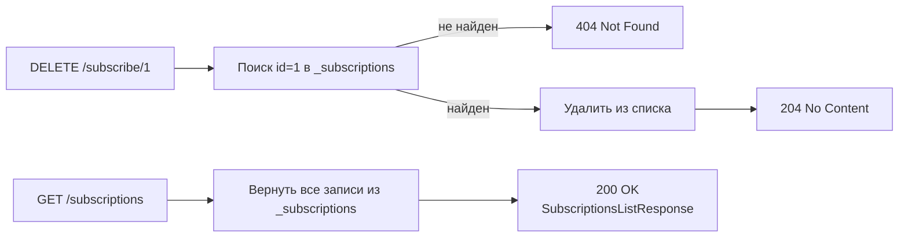

# План реализации DELETE /subscribe/{id} и GET /subscriptions

## Контекст

**Текущее состояние:**
- [`routers/subscription.py`](../routers/subscription.py) — содержит `POST /subscribe` и in-memory хранилище `_subscriptions: list[dict]`
- Каждая запись в `_subscriptions` имеет поля: `id: int`, `email: str`, `city: str`
- [`models/subscription.py`](../models/subscription.py) — содержит `SubscriptionRequest`, `SubscriptionResponse`

**Что нужно добавить:**
- `DELETE /subscribe/{id}` — удалить подписку по ID
- `GET /subscriptions` — получить список всех подписок

---

## Новые модели

### `SubscriptionItem` — элемент списка подписок (для `GET /subscriptions`)

Добавить в [`models/subscription.py`](../models/subscription.py):

```python
class SubscriptionItem(BaseModel):
    subscription_id: int
    email: str
    city: str
```

Не включает данные о погоде — это список подписок, а не запрос погоды.

### `SubscriptionsListResponse` — ответ `GET /subscriptions`

```python
class SubscriptionsListResponse(BaseModel):
    subscriptions: list[SubscriptionItem]
    total: int
```

Обновить [`models/__init__.py`](../models/__init__.py) — добавить реэкспорт новых моделей.

---

## Эндпоинты

### DELETE /subscribe/{id}

**Запрос:**
```
DELETE /subscribe/1
```

**Логика:**
1. Найти в `_subscriptions` запись с `id == subscription_id`
2. Если не найдена → `HTTPException(404, "Subscription not found")`
3. Удалить запись из списка
4. Вернуть `204 No Content`

**HTTP коды:**

| Код | Ситуация |
|-----|----------|
| 204 | Подписка удалена |
| 404 | Подписка с таким ID не найдена |

**Декоратор:**
```python
@router.delete(
    "/subscribe/{subscription_id}",
    status_code=204,
    responses={404: {"model": ErrorResponse}},
    summary="Удалить подписку по ID",
)
```

---

### GET /subscriptions

**Запрос:**
```
GET /subscriptions
```

**Логика:**
1. Вернуть все записи из `_subscriptions` в виде `SubscriptionsListResponse`
2. Если список пуст — вернуть пустой список (не 404)

**Ответ (200 OK):**
```json
{
  "subscriptions": [
    {"subscription_id": 1, "email": "user@test.com", "city": "Moscow"},
    {"subscription_id": 2, "email": "other@test.com", "city": "London"}
  ],
  "total": 2
}
```

**HTTP коды:**

| Код | Ситуация |
|-----|----------|
| 200 | Список подписок (может быть пустым) |

**Декоратор:**
```python
@router.get(
    "/subscriptions",
    response_model=SubscriptionsListResponse,
    summary="Получить список всех подписок",
)
```

---

## Поток данных



---

## Шаги реализации

### Шаг 1 — Добавить модели в [`models/subscription.py`](../models/subscription.py)

Добавить `SubscriptionItem` и `SubscriptionsListResponse`.

### Шаг 2 — Обновить [`models/__init__.py`](../models/__init__.py)

Добавить реэкспорт `SubscriptionItem`, `SubscriptionsListResponse`.

### Шаг 3 — Добавить эндпоинты в [`routers/subscription.py`](../routers/subscription.py)

Добавить два новых обработчика в существующий `router`:
- `delete_subscription(subscription_id: int)` — `DELETE /subscribe/{subscription_id}`
- `get_subscriptions()` — `GET /subscriptions`

Существующий `POST /subscribe` и хранилище `_subscriptions` не трогать.

---

## Что НЕ меняется

| Компонент | Статус |
|-----------|--------|
| `POST /subscribe` | Без изменений |
| [`routers/weather.py`](../routers/weather.py) | Без изменений |
| [`main.py`](../main.py) | Без изменений |
| In-memory хранилище `_subscriptions` | Переиспользуется |
