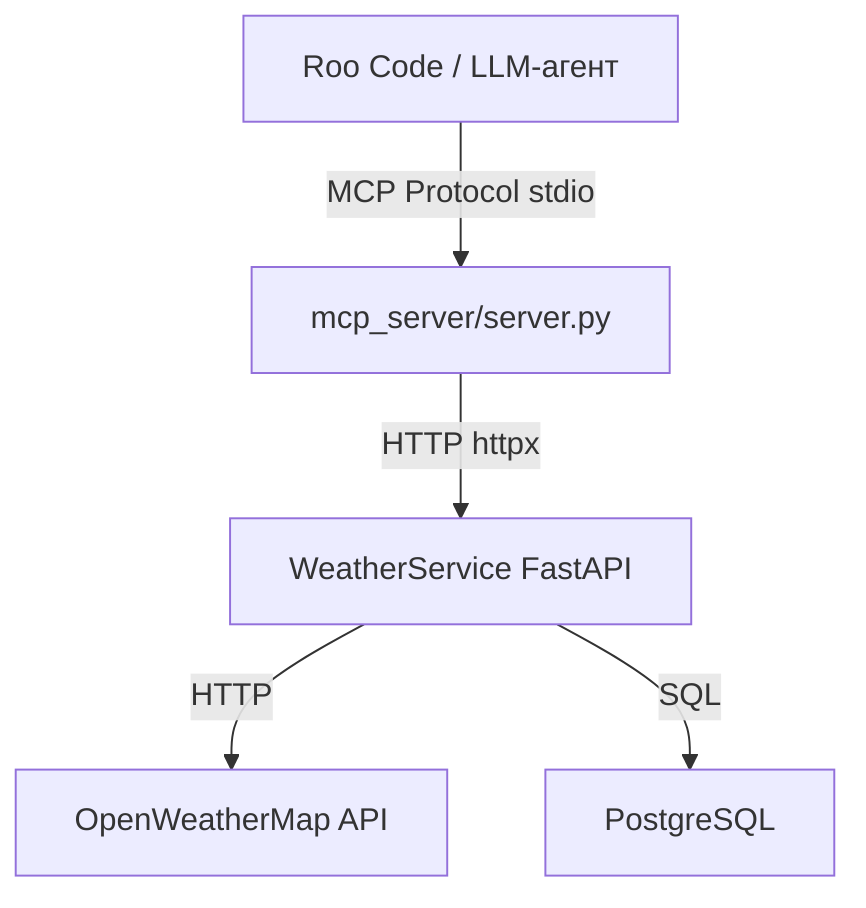

# План: WeatherService Client MCP-сервер

## Цель

Создать MCP-сервер на `fastmcp` (Python), который оборачивает WeatherService API и предоставляет LLM-агентам (Roo Code) инструменты для работы с погодой и подписками.

## Архитектура



## Структура файлов

```
mcp_server/
├── __init__.py
├── server.py       # FastMCP сервер с 4 инструментами
├── client.py       # Async HTTP-клиент к WeatherService API
└── README.md       # Инструкция по запуску и подключению к Roo Code
```

## Инструменты MCP-сервера

| Tool | Описание | Параметры | Возвращает |
|------|----------|-----------|------------|
| `get_weather` | Получить текущую погоду для города | `city: str` | JSON с temp, humidity, description |
| `create_subscription` | Подписаться на уведомления о погоде | `email: str, city: str` | subscription_id, city, weather |
| `list_subscriptions` | Получить список всех подписок | — | список подписок с email и городом |
| `delete_subscription` | Удалить подписку по ID | `subscription_id: int` | подтверждение удаления |

## Детали реализации

### `mcp_server/client.py`

- Класс `WeatherServiceClient` с методами для каждого эндпоинта
- Использует `httpx.AsyncClient` для HTTP-запросов
- Базовый URL читается из переменной окружения `WEATHER_SERVICE_URL` (по умолчанию `http://localhost:8000`)
- Все методы — `async def` с type annotations
- Обработка HTTP-ошибок: возвращает dict с полем `error`

### `mcp_server/server.py`

- Инициализация: `mcp = FastMCP(name="WeatherService Client")`
- Каждый инструмент — функция с декоратором `@mcp.tool`
- Docstring инструмента = описание для LLM
- Запуск через `mcp.run()` (транспорт: stdio для Roo Code)
- Импорт клиента: `from mcp_server.client import WeatherServiceClient`

### Пример инструмента

```python
from fastmcp import FastMCP
from mcp_server.client import WeatherServiceClient

mcp = FastMCP(name="WeatherService Client")
client = WeatherServiceClient()

@mcp.tool
async def get_weather(city: str) -> dict:
    """Получить текущую погоду для указанного города через WeatherService API."""
    return await client.get_weather(city)

if __name__ == "__main__":
    mcp.run()
```

## Зависимости

Добавить в `requirements.txt`:
```
fastmcp
```

`httpx` уже есть в зависимостях проекта.

## Конфигурация для Roo Code

Файл `.roo/mcp.json` (или через настройки Roo Code):

```json
{
  "mcpServers": {
    "weather-service": {
      "command": "python",
      "args": ["-m", "mcp_server.server"],
      "cwd": "/path/to/practice_03",
      "env": {
        "WEATHER_SERVICE_URL": "http://localhost:8000"
      }
    }
  }
}
```

## Порядок реализации

1. Создать `mcp_server/__init__.py` (пустой)
2. Написать `mcp_server/client.py` — HTTP-клиент с 4 методами
3. Написать `mcp_server/server.py` — FastMCP сервер с 4 инструментами
4. Добавить `fastmcp` в `requirements.txt`
5. Написать `mcp_server/README.md` с инструкцией
6. Добавить конфигурацию MCP в настройки Roo Code

## Правила кода (из AGENTS.md)

- Docstrings разрешены, inline-комментарии — нет
- snake_case для функций и переменных
- Type annotations для всех сигнатур
- f-strings вместо `.format()`
- Группировка импортов: stdlib → third-party → local
- Не использовать bare `except:` — только конкретные типы исключений
- Переменные окружения через `os.getenv()`, не хардкодить
