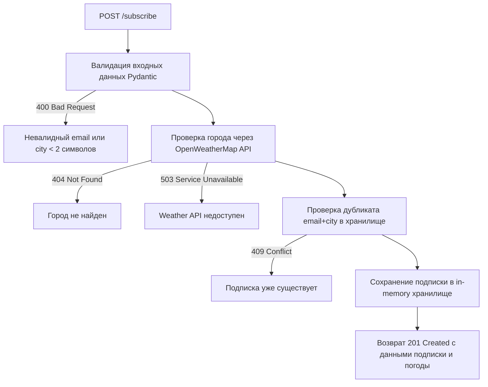

# План реализации POST /subscribe

## Контекст

**Проект:** WeatherService — REST API на FastAPI (Python)
**Цель:** Реализовать эндпоинт `POST /subscribe`, позволяющий пользователю подписаться на уведомления о погоде для выбранного города.

**Текущее состояние проекта:**
- [`main.py`](../main.py) — содержит только `GET /weather/{city}`
- [`models.py`](../models.py) — содержит только `WeatherResponse` и `ErrorResponse`
- [`requirements.txt`](../requirements.txt) — уже есть `email-validator`, `pydantic`, `httpx`, `fastapi`
- Хранилище данных: **in-memory** (список Python), без PostgreSQL и Redis (они не установлены в зависимостях)
- Правило проекта: **docstring можно писать, комментарии — нет**

---

## Целевая структура файлов

```
practice_03/
├── main.py                      ← только создание app и подключение роутеров
├── models/
│   ├── __init__.py              ← реэкспорт всех моделей
│   ├── weather.py               ← WeatherResponse, ErrorResponse
│   └── subscription.py         ← SubscriptionRequest, SubscriptionResponse
├── routers/
│   ├── __init__.py
│   ├── weather.py               ← GET /weather/{city}, _fetch_weather()
│   └── subscription.py         ← POST /subscribe, in-memory хранилище
├── requirements.txt             ← без изменений
└── plans/
    └── plan_post_subscribe.md
```

Принцип: **один файл — одна ответственность**. Модели отделены от роутеров, каждый домен (weather, subscription) — в своём модуле.

---

## Архитектура эндпоинта

### Запрос

```
POST /subscribe
Content-Type: application/json

{
  "city": "Moscow",
  "email": "user@test.com"
}
```

### Логика обработки



### Ответ (201 Created)

```json
{
  "subscription_id": 1,
  "city": "Moscow",
  "email": "user@test.com",
  "weather": {
    "city": "Moscow",
    "temp": 15.0,
    "humidity": 60,
    "description": "clear sky"
  }
}
```

### HTTP коды ответов

| Код | Ситуация |
|-----|----------|
| 201 | Подписка успешно создана |
| 400 | Невалидный email или city (Pydantic ValidationError) |
| 404 | Город не найден в OpenWeatherMap |
| 409 | Подписка для этого email+city уже существует |
| 503 | OpenWeatherMap API недоступен (таймаут или сетевая ошибка) |

---

## Шаги реализации

### Шаг 1 — Создать [`models/weather.py`](../models/weather.py)

Перенести из [`models.py`](../models.py):
- `WeatherResponse` — без изменений
- `ErrorResponse` — без изменений

---

### Шаг 2 — Создать [`models/subscription.py`](../models/subscription.py)

Новые Pydantic-модели:

**`SubscriptionRequest`** — тело запроса:
- `email: EmailStr` — валидный email (`email-validator` уже есть в `requirements.txt`)
- `city: str = Field(min_length=2, max_length=100)` — название города

**`SubscriptionResponse`** — тело ответа 201:
- `subscription_id: int`
- `city: str`
- `email: str`
- `weather: WeatherResponse` — вложенный объект (импорт из `models.weather`)

Импорты: `EmailStr, Field` из `pydantic`, `WeatherResponse` из `models.weather`.

---

### Шаг 3 — Создать [`models/__init__.py`](../models/__init__.py)

Реэкспортировать все модели для удобного импорта:
```python
from models.weather import WeatherResponse, ErrorResponse
from models.subscription import SubscriptionRequest, SubscriptionResponse
```

Старый [`models.py`](../models.py) удалить (или оставить пустым с импортом из пакета для обратной совместимости).

---

### Шаг 4 — Создать [`routers/weather.py`](../routers/weather.py)

Перенести из [`main.py`](../main.py):
- Константы `OPENWEATHER_API_KEY`, `OPENWEATHER_URL`, `REQUEST_TIMEOUT`
- Приватную async-функцию `_fetch_weather(city: str) -> WeatherResponse` — выделить HTTP-логику из `get_weather`, чтобы её мог переиспользовать роутер подписок
- Эндпоинт `GET /weather/{city}` — теперь вызывает `_fetch_weather`
- Создать `APIRouter` и зарегистрировать на нём эндпоинт

---

### Шаг 5 — Создать [`routers/subscription.py`](../routers/subscription.py)

In-memory хранилище на уровне модуля:
- `_subscriptions: list[dict]` — список подписок
- `_counter: int` — счётчик для генерации `subscription_id`

Логика `POST /subscribe`:

1. **Проверка дубликата** — найти запись с совпадающими `email` и `city.lower()`. Если найдена → `HTTPException(409, "Subscription already exists")`.

2. **Проверка города** — вызвать `_fetch_weather(city)` из `routers.weather`. Если город не найден или API недоступен — исключение уже выброшено внутри `_fetch_weather`.

3. **Сохранение** — добавить запись в `_subscriptions`, инкрементировать `_counter`.

4. **Вернуть `SubscriptionResponse`** со статусом 201.

Декоратор:
```python
@router.post(
    "/subscribe",
    response_model=SubscriptionResponse,
    status_code=201,
    responses={
        400: {"model": ErrorResponse},
        404: {"model": ErrorResponse},
        409: {"model": ErrorResponse},
        503: {"model": ErrorResponse},
    },
    summary="Подписаться на уведомления о погоде",
)
```

---

### Шаг 6 — Создать [`routers/__init__.py`](../routers/__init__.py)

Пустой файл (делает директорию пакетом Python).

---

### Шаг 7 — Обновить [`main.py`](../main.py)

Оставить только:
- Создание `app = FastAPI(...)`
- Подключение роутеров: `app.include_router(weather_router)` и `app.include_router(subscription_router)`
- Настройку логирования

---

## Ограничения и допущения

| Аспект | Решение |
|--------|---------|
| База данных | In-memory список (PostgreSQL не в зависимостях) |
| Кэширование | Без Redis (не в зависимостях) |
| Аутентификация | Не требуется для v1.0 |
| Комментарии в коде | Запрещены правилом проекта; использовать только docstring |
| Дублирование city | Сравнение регистронезависимое (`city.lower()`) |
